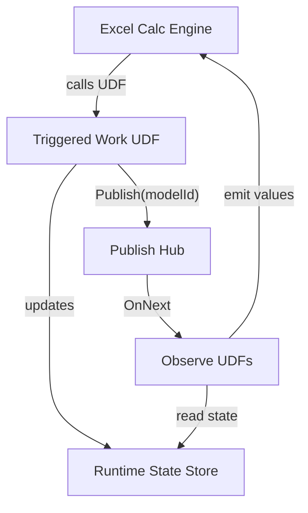
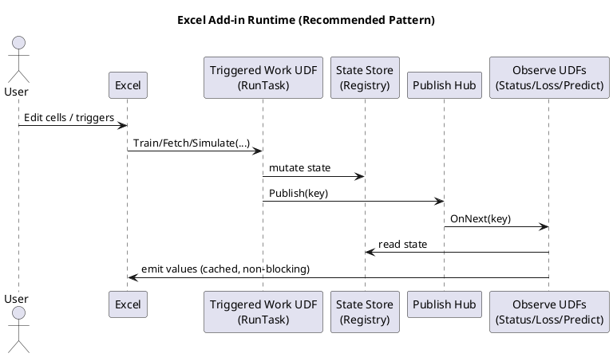

# Excel-DNA Utility Functions

A C# and Excel-DNA collection of worksheet UDFs for calculation control, text processing, dynamic arrays, machine learning, embeddings, and OpenAI-compatible or Ollama LLMs.

- **Author:** Nicolas Pepin
- **Version:** 4.0.0
- **License:** MIT
- **Primary deployment:** standalone Excel-DNA XLL via `deploy.sh`
- **Alternative source:** `Custom-Excel-DNA-UDFs-ESharper.cs`

## Contents

- [Quick start](#quick-start)
- [UDF catalog by category](#udf-catalog-by-category)
- [Building, deployment, and testing](#building-and-deployment)
- [AI user guide](USER-GUIDE_AI.md)
- [Consolidated project documentation](#repository-summary-and-metadata)

## Quick start

1. Run `./deploy.sh`.
2. Keep every file in `dist/` together.
3. Load `dist/CustomExcelDnaUdfs.xll` through Excel Add-ins.
4. Open `Tests.xlsx` and recalculate.
5. For local LLMs, start Ollama and configure `LLM_Test_Data`; for OpenAI-compatible services, enter the base URL, model, provider, and API key.

The source intentionally avoids third-party runtime libraries. It uses Excel-DNA, Office Interop, and .NET Framework libraries already available to the build.

## UDF catalog by category

### Workbook-wide volatility controls
#### `SETVOLATILITY(enable)`
Enables or disables the collection-wide volatility switch. Use `=SETVOLATILITY(FALSE)` for large models unless legacy recalculation behavior is required.
#### `GETVOLATILITY()`
Returns `ENABLED` or `DISABLED`.
### Workbook, calculation, and state control
#### `VEXCELDNA()`
   - Returns the current version of the UDF collection
   - **Usage**: `=VEXCELDNA()`
   - **Returns**: String with the version number
#### `SETTARGETVERSION(version)`
   - Sets the target version for backward compatibility
   - **Usage**: `=SETTARGETVERSION("2.0.0")`
   - **Returns**: Confirmation string with the previous and current target version
#### `GETTARGETVERSION()`
   - Gets the current target version for backward compatibility
   - **Usage**: `=GETTARGETVERSION()`
   - **Returns**: String with the current target version
#### `RECALCALL()`
   - Triggers a full recalculation of the workbook
   - **Usage**: `=RECALCALL()`
   - **Returns**: `"TRUE"` on success
#### `GETITERATIONSTATUS()`
   - Returns Excel's iterative calculation settings
   - **Usage**: `=GETITERATIONSTATUS()`
   - **Returns**: String with status (ON/OFF), max iterations, and max change
#### `SETITERATION(IterationOn, [maxIterations], [maxChange])`
   - Configures Excel's iterative calculation settings
   - **Usage**: `=SETITERATION(TRUE, 100, 0.001)`
   - **Returns**: Confirmation string with current settings
#### `ISVISIBLE([cachingTime])`
   - Checks if a cell is visible (not hidden by rows/columns)
   - **Usage**: `=ISVISIBLE(10)` (10 second cache duration)
   - **Returns**: `"TRUE"` if visible, `"FALSE"` if hidden
#### `DESCRIBE(cell_reference)`
   - Returns a description of the cell's content type
   - **Usage**: `=DESCRIBE(A1)`
   - **Returns**: String describing the value type
#### `INJECTVALUE(cell_reference, value)`
   - Injects a value into a cell (stateful operation)
   - **Usage**: `=INJECTVALUE(B2, "Test Value")`
   - **Returns**: The injected value
#### `PUTOBJECT(name, value, [force], [debug])`
    - Stores an object in temporary storage
    - **Usage**: `=PUTOBJECT("temp1", A1:A10, TRUE)`
    - **Returns**: The stored object
#### `GETOBJECT(name, [debug])`
    - Retrieves an object from temporary storage
    - **Usage**: `=GETOBJECT("temp1")`
    - **Returns**: The stored object or error
#### `PURGEOBJECTS()`
    - Clears all objects from temporary storage
    - **Usage**: `=PURGEOBJECTS()`
    - **Returns**: `"TRUE"` on success
#### `GETTHREADS()`
    - Returns Excel's current thread count for calculations
    - **Usage**: `=GETTHREADS()`
    - **Returns**: Integer thread count
#### `SETTHREADS(threadCount)`
    - Configures Excel's calculation thread count
    - **Usage**:
      `=SETTHREADS(4)` (Use 4 threads)
      `=SETTHREADS(0)` (Use all processors)
    - **Returns**: Actual thread count set
### Text, parsing, and regular expressions
#### `FINDPOS(text, substring, instance)`
    - Finds positions of substrings (case-insensitive)
    - **Usage**: `=FINDPOS("Hello World", "o", 1)`
    - **Returns**: Position number or error if not found
#### `EXTRACTSUBSTR(inputString, startMarker, [endMarker])`
    - Extracts a substring between start and end markers
    - **Usage**: `=EXTRACTSUBSTR("A=[123] Z", "A=[", "]")`
    - **Returns**: Extracted substring or `#N/A` if markers are not found
#### `STRING_COMMON(s1, s2, minLength)`
    - Returns maximal common substrings with a minimum length
    - **Usage**: `=STRING_COMMON("Hello there, how are you", "Hello there how are you", 5)`
    - **Returns**: Dynamic array of common substrings (empty if none meet `minLength`)
#### `STRING_DIFF(s1, s2, minLength)`
    - Returns maximal differing substrings with a minimum length
    - **Usage**: `=STRING_DIFF("Hello there, how are you", "Hello there how are you", 1)`
    - **Returns**: Dynamic array of differing substrings from both inputs
#### `TEXT_BEFORE(text, delimiter, [instance])`
    - Returns text before a selected delimiter occurrence
    - **Usage**: `=TEXT_BEFORE("North|America|Canada", "|", 2)`
    - **Returns**: `"North|America"`; returns `#N/A` when the occurrence is absent
#### `TEXT_AFTER(text, delimiter, [instance])`
    - Returns text after a selected delimiter occurrence
    - **Usage**: `=TEXT_AFTER("North|America|Canada", "|", 2)`
    - **Returns**: `"Canada"`; returns `#N/A` when the occurrence is absent
#### `REGEX_ISMATCH(text, pattern, [ignoreCase])`
    - Tests text against a .NET regular expression with a one-second timeout
    - **Usage**: `=REGEX_ISMATCH("INV-2026-0042", "^INV-[0-9]{4}-[0-9]{4}$")`
    - **Returns**: `TRUE` for a match, `FALSE` otherwise, or `#VALUE!` for an invalid pattern
#### `REGEX_EXTRACT(text, pattern, [group])`
    - Returns the first regex match or a numbered or named capture group
    - **Usage**: `=REGEX_EXTRACT("Order 8472", "Order ([0-9]+)", 1)`
    - **Returns**: `"8472"`; returns `#N/A` when no match or group exists
#### `REGEX_REPLACE(text, pattern, replacement, [ignoreCase])`
    - Replaces every regex match using standard .NET replacement syntax
    - **Usage**: `=REGEX_REPLACE("A  B   C", "\s+", " ")`
    - **Returns**: `"A B C"`; returns `#VALUE!` for an invalid pattern
### Arrays, membership, hashing, and numeric helpers
#### `TRUESPLIT(input_array, delimiter)`
    - Splits strings into dynamic arrays
    - **Usage**: `=TRUESPLIT(A1:A3, ",")`
    - **Returns**: 2D array of split components
#### `ISMEMBEROF(array1, array2)`
    - Checks for common elements between arrays
    - **Usage**: `=ISMEMBEROF(A1:A10, B1:B20)`
    - **Returns**: `TRUE` if any match found
#### `HASHARRAY(input_array, [hashLength])`
    - Computes a consistent hash value for an array of values
    - **Usage**: `=HASHARRAY(A1:A10, 8)`
    - **Returns**: Hash string (default length 8, range 4–32)
#### `ISLOCALIP(ipAddress_string)`
    - Checks if an IP address is a local IP (private or loopback)
    - **Usage**: `=ISLOCALIP(ipAddress_string)`
    - **Returns**: `TRUE` if local IP, `FALSE` otherwise or `#N/A` if invalid input
#### `ARRAYSUBTRACT(arrayA, arrayB)`
    - Subtracts values in `arrayB` from `arrayA`, preserving shape where possible
    - **Usage**: `=ARRAYSUBTRACT(A1:A10, B1:B3)`
    - **Returns**: Dynamic array of values from `arrayA` that are not present in `arrayB`
#### `ARRAY_UNIQUE(inputArray, [ignoreCase])`
    - Returns unique nonblank values as a vertical dynamic array in first-seen order
    - **Usage**: `=ARRAY_UNIQUE(A2:A100, TRUE)`
    - **Returns**: A spill range; `TRUE` makes text comparisons case-insensitive
#### `ARRAY_DISTINCT_COUNT(inputArray, [ignoreCase])`
    - Counts unique nonblank values using the same comparison rules as `ARRAY_UNIQUE`
    - **Usage**: `=ARRAY_DISTINCT_COUNT(A2:A100, TRUE)`
    - **Returns**: Integer distinct count
#### `NUM_CLAMP(value, minimum, maximum)`
    - Restricts a number to an inclusive lower and upper bound
    - **Usage**: `=NUM_CLAMP(125, 0, 100)`
    - **Returns**: `100`; returns `#VALUE!` when inputs are invalid or minimum exceeds maximum

### Machine Learning and AI vector UDFs
### Machine learning: vector operations
#### `VECTOR_DOT(vectorA, vectorB)`
    - Computes the dot product of equally sized row or column vectors
    - **Usage**: `=VECTOR_DOT(A2:A5, B2:B5)`
    - **Returns**: Scalar dot product
#### `VECTOR_NORM(vector, [p])`
    - Computes an L-p norm, with Euclidean norm (`p=2`) as the default
    - **Usage**: `=VECTOR_NORM(A2:A5, 2)`
    - **Returns**: Scalar norm for any positive finite `p`
#### `VECTOR_NORMALIZE(vector, [p])`
    - Normalizes a vector to unit L-p norm while preserving row or column orientation
    - **Usage**: `=VECTOR_NORMALIZE(A2:A5)`
    - **Returns**: Dynamic vector; a zero vector returns `#DIV/0!`
#### `VECTOR_COSINE_SIMILARITY(vectorA, vectorB)`
    - Measures directional similarity, commonly used for embeddings
    - **Usage**: `=VECTOR_COSINE_SIMILARITY(A2:A5, B2:B5)`
    - **Returns**: Similarity from approximately `-1` to `1`
#### `VECTOR_EUCLIDEAN_DISTANCE(vectorA, vectorB)`
    - Computes straight-line distance between feature vectors
    - **Usage**: `=VECTOR_EUCLIDEAN_DISTANCE(A2:A5, B2:B5)`
    - **Returns**: Nonnegative scalar distance
#### `VECTOR_MANHATTAN_DISTANCE(vectorA, vectorB)`
    - Computes L1 distance between feature vectors
    - **Usage**: `=VECTOR_MANHATTAN_DISTANCE(A2:A5, B2:B5)`
    - **Returns**: Sum of absolute element differences
#### `VECTOR_SOFTMAX(vector)`
    - Converts logits into probabilities using a numerically stable implementation
    - **Usage**: `=VECTOR_SOFTMAX(B2:B6)`
    - **Returns**: Dynamic vector with values summing to approximately `1`
#### `VECTOR_SIGMOID(vector)`
    - Applies logistic sigmoid activation element-wise
    - **Usage**: `=VECTOR_SIGMOID(B2:B6)`
    - **Returns**: Dynamic vector with values between `0` and `1`
#### `VECTOR_RELU(vector)`
    - Applies rectified linear activation element-wise
    - **Usage**: `=VECTOR_RELU(B2:B6)`
    - **Returns**: Dynamic vector with negative values replaced by zero

### Machine Learning and AI matrix UDFs
#### `VECTOR_LOG_SOFTMAX(vector)`
    - Converts logits to log probabilities using a stable log-sum-exp calculation
    - **Usage**: `=VECTOR_LOG_SOFTMAX(B2:B6)`
    - **Returns**: Dynamic row or column vector preserving the input orientation
#### `VECTOR_TOP_K(vector, k, [largest])`
    - Ranks a vector and returns source positions with their values
    - **Usage**: `=VECTOR_TOP_K(B2:B100, 5, TRUE)`
    - **Returns**: A `k`-by-2 spill array containing 1-based index and value; ties preserve source order
### Machine learning: matrix operations
#### `MATRIX_STANDARDIZE_COLUMNS(matrix, [sample])`
    - Z-score standardizes each feature column, treating rows as observations
    - **Usage**: `=MATRIX_STANDARDIZE_COLUMNS(A2:D101)`
    - **Returns**: Dynamic matrix; constant columns become zeros
#### `MATRIX_MINMAX_SCALE_COLUMNS(matrix, [targetMin], [targetMax])`
    - Scales every feature column into a requested range, defaulting to `[0,1]`
    - **Usage**: `=MATRIX_MINMAX_SCALE_COLUMNS(A2:D101, -1, 1)`
    - **Returns**: Dynamic scaled matrix; constant columns use `targetMin`
#### `MATRIX_PAIRWISE_DISTANCE(matrix, [metric])`
    - Builds a square row-to-row distance matrix
    - **Usage**: `=MATRIX_PAIRWISE_DISTANCE(A2:D20, "cosine")`
    - **Returns**: Dynamic matrix using `euclidean`, `manhattan`, or `cosine` distance
#### `MATRIX_COVARIANCE(matrix, [sample])`
    - Computes covariance between feature columns
    - **Usage**: `=MATRIX_COVARIANCE(A2:D101, TRUE)`
    - **Returns**: Symmetric feature-by-feature covariance matrix
#### `MATRIX_ONE_HOT(labels, [classLabels])`
    - One-hot encodes a row or column label vector
    - **Usage**: `=MATRIX_ONE_HOT(A2:A101)`
    - **Returns**: Dynamic indicator matrix; inferred class order is first-seen unless supplied explicitly
#### `MATRIX_CONFUSION(actual, predicted, [classLabels])`
    - Builds a multiclass confusion matrix with actual classes as rows and predictions as columns
    - **Usage**: `=MATRIX_CONFUSION(A2:A101, B2:B101)`
    - **Returns**: Dynamic count matrix using explicit or first-seen class order
#### `MATRIX_LINEAR_PREDICT(matrix, weights, [bias])`
    - Applies a dense linear layer to row observations
    - **Usage**: `=MATRIX_LINEAR_PREDICT(A2:D100, F2:H5, J2:L2)`
    - **Returns**: Observation-by-output prediction matrix; bias may be omitted, scalar, or output-length
#### `MATRIX_CORRELATION(matrix)`
    - Computes Pearson correlation between feature columns
    - **Usage**: `=MATRIX_CORRELATION(A2:D100)`
    - **Returns**: Symmetric feature correlation matrix; constant columns return `#DIV/0!`
#### `MATRIX_KMEANS_ASSIGN(matrix, centroids, [metric])`
    - Assigns each observation to its nearest centroid
    - **Usage**: `=MATRIX_KMEANS_ASSIGN(A2:D100, F2:I6, "euclidean")`
    - **Returns**: Two-column spill array containing 1-based centroid index and distance
### OpenAI-compatible and Ollama LLM functions

Network UDFs use `ExcelAsyncUtil.Run`, so Excel remains responsive while an HTTP request is in flight. They are intentionally **not** registered as thread-safe. `LLM_JSON_VALUE` is local, deterministic, and thread-safe.

Provider rules:

- Omit `provider` to default to Ollama unless the base URL clearly contains `/v1` or `openai`.
- Default Ollama base URL: `http://localhost:11434`.
- Default OpenAI base URL: `https://api.openai.com/v1`.
- Pass a **base URL**, not a full endpoint. The UDF appends `/v1/chat/completions`, `/v1/embeddings`, `/v1/models`, `/api/chat`, `/api/embed`, or `/api/tags`.
- Network failures return readable strings beginning with `LLM_ERROR:`. Invalid worksheet arguments return an Excel error.

#### `LLM_CHAT(prompt, model, [baseUrl], [apiKey], [systemPrompt], [temperature], [maxTokens], [provider])`
Sends a text chat request and returns the assistant message.

- Ollama: `=LLM_CHAT(A2,"llama3.2","http://localhost:11434","","Answer concisely",0.2,256,"ollama")`
- OpenAI-compatible: `=LLM_CHAT(A2,"your-chat-model","https://api.openai.com/v1",$B$1,"Answer concisely",0.2,256,"openai")`

#### `LLM_CHAT_IMAGE(prompt, imageBase64, model, [mimeType], [baseUrl], [apiKey], [systemPrompt], [temperature], [maxTokens], [provider])`
Sends a Base64 image to a vision-capable model. The image may be raw Base64 or a `data:image/...;base64,...` URI.

`=LLM_CHAT_IMAGE("Describe the screenshot",B2,"llava","image/png","http://localhost:11434","","Focus on anomalies",0,128,"ollama")`

#### `LLM_EMBED(text, model, [baseUrl], [apiKey], [provider])`
Returns one embedding as a vertical spill vector.

`=LLM_EMBED(A2,"nomic-embed-text","http://localhost:11434","","ollama")`

#### `LLM_EMBED_BATCH(texts, model, [baseUrl], [apiKey], [provider])`
Returns an observation-by-dimension matrix: one row per source text.

`=LLM_EMBED_BATCH(A2:A20,"nomic-embed-text","http://localhost:11434","","ollama")`

#### `LLM_LIST_MODELS([baseUrl], [apiKey], [provider])`
Lists available model identifiers as a vertical spill range.

`=LLM_LIST_MODELS("http://localhost:11434","","ollama")`

#### `LLM_JSON_VALUE(json, path)`
Extracts a scalar or array from JSON. Paths use dotted properties and zero-based array indices.

`=LLM_JSON_VALUE(A2,"choices[0].message.content")`

See [USER-GUIDE_AI.md](USER-GUIDE_AI.md) for illustrated workflows combining these functions with the vector and matrix UDFs.


## Version 4.0.0 design notes

- Adds six LLM and generative-AI UDFs covering chat, vision, embeddings, model discovery, and JSON extraction.
- Network work is asynchronous and returns `LLM_ERROR:` text for HTTP/provider failures.
- API keys are never included directly in the Excel-DNA async cache key; only a short SHA-256-derived fingerprint is used.
- The deterministic ML/AI collection remains 20 thread-safe vector and matrix UDFs.
- `Tests.xlsx` now contains separate ML/AI and LLM worksheet harnesses.
- The command-line harness uses a local mock HTTP server and requires no real API key or external LLM service.

## Integration with eSharper

The standalone `Custom-Excel-DNA-UDFs-ESharper.cs` file remains compatible with the [eSharper](https://vlasovstudio.com/esharper/) Excel add-in container for rapid interactive development. The normal deployment path uses `deploy.sh` and does not require eSharper.

## C# Version Compatibility

These UDFs use features from C# 10. Attempting to use syntax from later C# versions may cause compilation errors.

**Compatibility Notes:**
- Excel-DNA supports .NET Framework 4.5.2+ and .NET 6+/8.
- eSharper relies on the .NET version available within Excel, potentially limiting newer features.

## Building and Deployment

**Requirements:**
- Visual Studio 2022+
- .NET Framework 4.7.2 SDK or .NET 6.0 SDK
- Excel-DNA NuGet package

**Automated deployment:**
1. Install Mono (`mcs` and `mono`), `curl`, and Python 3.
2. Run `./deploy.sh`.
3. Copy the contents of `dist/` together and load `dist/CustomExcelDnaUdfs.xll` from Excel Add-ins.

The script downloads pinned Excel-DNA and Office Interop packages, compiles the managed assembly, creates the `.dna` manifest, and builds a standard Excel-DNA XLL deployment bundle. It defaults to 64-bit Excel; set `ARCH=x86` for 32-bit Excel. On Windows or under Wine, it also creates `CustomExcelDnaUdfs-packed.xll` when packing is available. Use `PACK_XLL=false` to skip packing or `PACK_XLL=true` to require it.

**Testing:** Run `./tests/run-tests.sh` for the command-line C# harness. Open `Tests.xlsx` with `dist/CustomExcelDnaUdfs.xll` loaded. `AIML_UDF_Tests` validates the 20 deterministic ML/AI functions; `LLM_UDF_Tests` supplies live OpenAI/Ollama formulas plus an offline JSON assertion.

## License

MIT License. See `LICENSE` file.

---

## Appendix A: Excel-DNA Technical Overview


#### **What is Excel-DNA?**

ExcelDNA is a powerful library that allows developers to create high-performance Excel add-ins using .NET languages (like C# or VB.NET). Here's a technical breakdown of how it works:

##### **1. Core Architecture**

ExcelDNA bridges Excel's native C API (the **Excel XLL SDK**) with the .NET runtime. It does this by:

* **Compiling .NET code into an XLL**: An XLL is a DLL specifically designed for Excel. ExcelDNA generates a thin native XLL stub that loads the .NET runtime and hosts your managed code.

* **Using Managed/Unmanaged Interop**: The XLL acts as a bridge between Excel (unmanaged C/C++ world) and .NET (managed world) using P/Invoke and COM Interop.

##### **2. Key Components**

* **ExcelDna.Integration.dll**: Provides the core API for registering functions, handling callbacks, and marshaling data between Excel and .NET.

* **ExcelDna.Loader.dll**: Manages the dynamic loading of .NET assemblies into Excel.

* **ExcelDnaPack**: A tool that bundles custom .NET assemblies and dependencies into a single `.xll` file for deployment.

##### **3. Function Registration**

When Excel loads the XLL:

* **ExcelDNA scans your .NET assembly** for methods marked with Excel-specific attributes (e.g., `[ExcelFunction]`).

* **It generates Excel-compatible exports** (via `xlAutoOpen` and `xlAddInManagerInfo` callbacks).

* **Wraps .NET methods** in native XLL-compatible functions, handling type conversion between:

  * Excel `XLOPER`/`XLOPER12` types ↔ .NET types (double, string, object\[,], etc.).

  * Excel arrays ↔ .NET `object[,]` or `double[,]`.

##### **4. Marshaling & Memory Management**

* **Arguments passed from Excel** are converted into .NET types.

* **Return values** from .NET are packed back into Excel-compatible structures.

* **ExcelDNA manages memory** to prevent leaks (e.g., freeing temporary `XLOPER`s).

##### **5. Asynchronous & Multithreading Support**

* Excel is single-threaded (STA), but ExcelDNA allows **async functions** via `[ExcelAsync]`.

* Uses **.NET Tasks** to run computations in the background and return results later.

##### **6. RTD (Real-Time Data) Support**

* Implements Excel's **RTD server** interface for push-based real-time updates.

* Managed .NET code can push data to Excel cells in real time.

##### **7. COM & Ribbon Integration**

* If needed, ExcelDNA can expose .NET classes to Excel via COM (for UDFs or macros).

* Supports customizing the Ribbon UI via **Fluent UI XML**.

##### **8. Debugging & Deployment**

* Works with **Visual Studio debugging** (attach to Excel process).

* Packaged as a single `.xll` file (no separate installer needed).

##### **9. Performance Considerations**

* Minimal overhead (\~native speed) due to direct XLL integration.

* Avoids COM where possible for better performance.

##### **10. Comparison to Other Tech (VSTO, COM Add-ins)**

* **Faster** than VSTO (no COM overhead).

* **Lighter** than VSTO (no need for a separate runtime).

* **More flexible** than VBA (full .NET ecosystem access).

##### **Example Flow (Calling a .NET Function from Excel)**

1. User enters `=MyNetFunction(A1)` in Excel.

2. Excel calls the XLL’s exported stub.

3. ExcelDNA marshals arguments to .NET.

4. Your `[ExcelFunction]` method runs in .NET.

5. Return value is marshaled back to Excel.

ExcelDNA essentially makes .NET a first-class citizen in Excel while maintaining high performance and compatibility.

#### **How does it compare with Python-based approaches?**

ExcelDNA (for .NET) and Python integration in Excel serve different purposes and have distinct technical approaches. Here’s a detailed comparison:

##### **1. Technical Implementation**

| **Aspect**            | **ExcelDNA (.NET)**                       | **Python in Excel**                                                                 |
| --------------------- | ----------------------------------------- | ----------------------------------------------------------------------------------- |
| **Integration Level** | Deep XLL integration (native Excel C API) | Officially supported by Microsoft (via PyXLL, xlwings, or built-in Python in Excel) |
| **Performance**       | Near-native (minimal overhead)            | Slower (Python interpreter + marshaling)                                            |
| **Language**          | C#, F#, VB.NET                            | Python                                                                              |
| **Deployment**        | Single `.xll` file                        | Requires Python runtime, dependencies                                               |
| **Concurrency**       | Supports async via `[ExcelAsync]`         | Limited (Python's GIL can bottleneck multithreading)                                |
| **Real-Time Data**    | RTD support (push updates)                | Possible with PyXLL/xlwings, but slower                                             |
| **Debugging**         | Easy (attach to Excel process)            | Requires IDE setup (e.g., VS Code, PyCharm)                                         |

##### **2. Functionality & Use Cases**

| **Feature**                       | **ExcelDNA**                | **Python in Excel**                  |
| --------------------------------- | --------------------------- | ------------------------------------ |
| **User-Defined Functions (UDFs)** | Yes (high performance)      | Yes (slower, but flexible)           |
| **Macros & Automation**           | Yes (via `[ExcelMacro]`)    | Yes (xlwings, COM)                   |
| **Data Processing**               | Fast (direct .NET arrays)   | Slower (Pandas/NumPy marshaling)     |
| **Machine Learning**              | ML.NET, TensorFlow\.NET     | Full scikit-learn/TensorFlow/PyTorch |
| **Excel UI Control**              | Custom Ribbon, WinForms/WPF | Limited (depends on tool)            |
| **Cross-Platform**                | Windows-only                | Works on Mac (xlwings)               |

##### **3. Pros and Cons**

###### **ExcelDNA (.NET)**

 **Pros:**

* Blazing fast (native XLL performance).

* Direct access to Excel’s C API (low-level control).

* Strong typing (C#/F# reduces runtime errors).

* Easy deployment (single `.xll` file).

* Full .NET ecosystem (e.g., parallel computing, databases).

 **Cons:**

* Windows-only (no macOS support).

* Requires .NET knowledge.

* Only works with desktop version of Excel.

* Less popular for data science than Python.

###### **Python in Excel**

 **Pros:**

* **Built-in Python in Excel (Microsoft 365)**: No add-ins needed.

* **Huge ecosystem** (Pandas, NumPy, scikit-learn, etc.).

* **Better for prototyping** (Jupyter-like workflows).

* **Cross-platform** (xlwings works on Mac).

 **Cons:**

* **Slower** (Python interpreter + data marshaling).

* **Dependency hell** (conda/pip environments).

* **Limited real-time performance** (no RTD in pure Python).

* **Debugging is harder** (external IDE needed).

- - -

##### **4. When to Use Which?**

* **Use ExcelDNA if:**

  * You need **maximum performance** (financial models, real-time data).

  * You’re already using **.NET/C#**.

  * You need **deep Excel integration** (custom UI, RTD, async).

* **Use Python in Excel if:**

  * You’re doing **data science/ML** (Pandas, scikit-learn).

  * You prefer **quick prototyping** (Jupyter-style).

  * You need **cross-platform** support (Mac + Windows).


##### **5. Emerging Trends**

* **Microsoft’s built-in Python in Excel** (2023+):

  * Runs **Python in the cloud** (not locally).

  * Seamless grid integration (no add-ins).

  * Still early (limited libraries, no local execution).

* **Alternatives**:

  * **PyXLL**: Commercial, high-performance Python XLL.

  * **xlwings**: Free, but COM-based (slower).

##### **Final Verdict**

* **ExcelDNA** = **Speed + Control** (best for .NET devs).

* **Python in Excel** = **Flexibility + Ecosystem** (best for data scientists).

- - -

## Appendix B: Using Without eSharper

You do **not** need the eSharper add-in to use these Excel-DNA functions. They can be deployed as standard Excel add-ins using the following steps:

###  Requirements

* [Excel-DNA](https://excel-dna.net/)

* Visual Studio (recommended) or a text editor

* .NET Framework 4.7.2 or later _(for compatibility with most versions of Excel)_

* Excel (2010 or newer recommended)


###  Steps to Compile and Use the UDFs

#### 1. **Create or Use a `.dna` File**

Create a file named `MyAddIn.dna` with the following content:

``` xml
<DnaLibrary Name="MyExcelFunctions" RuntimeVersion="v4.0">
  <ExternalLibrary Path="MyFunctions.dll" />
</DnaLibrary>
```

* `MyFunctions.dll` is the compiled output of your `.cs` code (see next step).

* `RuntimeVersion` must match the .NET version used for compiling the DLL.

#### 2. **Compile Your `.cs` Code**

Compile your C# file into a class library (`.dll`). You can do this using:

* Visual Studio (File > New > Project > Class Library)

* Or with the command line:

``` bash

csc /target:library /out:MyFunctions.dll Custom-Excel-DNA-UDFs.cs
```

#### 3. **Download Excel-DNA Loader**

Download the latest [Excel-DNA binaries](https://github.com/Excel-DNA/ExcelDna/releases) and place the following in your project folder:

* `ExcelDna.Integration.dll`

* `ExcelDna.Loader.dll`

* `ExcelDna.xll` _(rename this to `MyAddIn.xll` for clarity)_

#### 4. **Build the `.xll` Add-In**

To link everything together, you should have:

``` bash

MyAddIn.dna
MyFunctions.dll
MyAddIn.xll (copied/renamed from ExcelDna.xll)
```

**Optional**: Use the Excel-DNA `Pack` utility to bundle the `.xll`, `.dll`, and `.dna` into a single file:

``` bash

ExcelDnaPack.exe MyAddIn.dna
```

This will create `MyAddIn-packed.xll`.

#### 5. **Load the Add-In in Excel**

* Open Excel.

* Go to `File > Options > Add-Ins`.

* At the bottom, select **Manage: Excel Add-ins**, and click **Go...**.

* Click **Browse**, find your `.xll` or `*-packed.xll` file, and open it.

* The UDFs will now be available as native Excel functions.

- - -

###  Notes

* Excel-DNA add-ins are fully portable and do not require administrator installation.

* You can distribute the `.xll` or `.xll + .dll` pair to other users.

* No COM registration is needed.

* You can sign your `.dll` for macro security compliance.

- - -
Excel-DNA is powerful and flexible, making it ideal for deploying managed-code add-ins without the overhead and complexity of COM registration or VSTO.


# Consolidated project documentation

## Repository summary and metadata

**Repository Summary:**

This repository provides a suite of high-performance, thread-safe Excel User Defined Functions (UDFs) developed using the Excel-DNA framework in C#. These functions significantly extend Excel's built-in capabilities for power users and developers, offering tools for advanced calculation control, dynamic data processing, and in-memory storage. The UDFs are easily deployable via Excel-DNA `.xll` add-ins and are compatible with the eSharper Excel add-in container for simplified testing and iteration within Excel 365.

**Keywords:**

Excel-DNA, Excel UDFs, C# Excel Add-in, Excel Automation, High-Performance Excel, eSharper, .NET Excel Integration, Excel Thread Management, Excel Custom Functions, Excel Macro Alternative.

## Version 3.9.0

The project includes 20 vector and matrix ML/AI UDFs, an Excel worksheet test harness, a command-line Mono test suite, a standalone Excel-DNA XLL deployment script, and a synchronized eSharper-compatible source file.

## Contributor and coding-agent standards

# AGENT.md

## Project Overview

This project is a collection of high-performance, thread-safe User Defined Functions (UDFs) for Microsoft Excel, implemented using Excel-DNA in C#. The UDFs extend Excel's native capabilities, providing advanced data manipulation, control over calculation settings, and utility functions for power users and developers.

- **Main UDF file:** Custom-Excel-DNA-UDFs.cs
- **Documentation:** README.md (user-facing), AGENT.md (agent/coder-facing)
- **Language:** C# (up to version 10)
- **Excel-DNA:** https://excel-dna.net/

## Coding Practices & Proven Approaches

### 1. **Function Structure**
- All UDFs are implemented as `public static` methods in a single class (usually `C`).
- Each UDF is decorated with `[ExcelFunction]` and `[ExcelArgument]` attributes for Excel-DNA registration and argument documentation.
- Volatility is controlled globally via a `MaybeVolatile()` helper and a global flag, not per-function attributes.
- Input validation is performed at the start of each function, returning appropriate `ExcelError` values for invalid input.
- Functions are designed to be thread-safe and avoid side effects unless explicitly documented (e.g., INJECTVALUE).

### 2. **Argument Handling**
- Use helper methods (e.g., `TryGetInt`) to robustly parse Excel arguments (handles int, double, string, etc.).
- Always check for null, empty, or error values before processing arguments.
- For optional arguments, use `object` type and check for `ExcelMissing` or `ExcelEmpty`.

### 3. **Return Values**
- Return types are `object`, `string`, `bool`, or `object[,]` (for arrays).
- For errors, return `ExcelError.ExcelErrorValue`, `ExcelError.ExcelErrorNA`, etc.
- For dynamic arrays, build and return a properly sized `object[,]`.

### 4. **Volatility**
- Use `MaybeVolatile()` at the top of any function that should be volatile when the global flag is enabled.
- Do **not** use `[ExcelFunction(IsVolatile = true)]` directly; rely on the global switch for consistency and performance.

### 5. **Stateful Functions**
- Functions that maintain state (e.g., INJECTVALUE, PUTOBJECT/GETOBJECT) use static dictionaries for storage.
- State is cleared with PURGEOBJECTS() or when the workbook closes.

### 6. **Error Handling**
- Use try/catch blocks for any code that interacts with Excel interop or may throw exceptions.
- Return Excel error codes or descriptive error messages for user-facing functions.

### 7. **Documentation**
- All new UDFs must be documented in README.md (user-facing) and AGENT.md (developer-facing).
- Use XML comments (`/// <summary>...</summary>`) for all public methods.
- Update the summary of functions at the top of the main C# file.

### 8. **Naming Conventions**
- UDF names are ALL_CAPS with underscores (e.g., `VECTOR_NORMALIZE`, `HASHARRAY`).
- Method names in C# use PascalCase (e.g., `TrimRight`).
- Arguments use camelCase or descriptive names.

### 9. **Compatibility**
- Only use C# 10 or earlier syntax/features.
- Avoid features from C# 11+ (e.g., list patterns, required properties, etc.).
- Ensure compatibility with .NET Framework 4.7.2+ and .NET 6+.

### 10. **Testing & Proven Patterns**
- New UDFs should follow the structure and validation patterns of existing, tested functions.
- Use helper methods for repeated logic (e.g., argument parsing, array building).
- Review similar UDFs for best practices before adding new ones.

### 11. **Pure Utility and ML UDF Pattern (Version 3.9.0)**
- Prefer deterministic, side-effect-free implementations for text, regex, array, numeric, and date utilities.
- Do not call `MaybeVolatile()` unless the result genuinely depends on external workbook or application state.
- For optional worksheet arguments, accept `object` and explicitly handle `ExcelMissing` and `ExcelEmpty`.
- Bound regular-expression execution with a timeout and convert invalid patterns or timeout failures to `ExcelError.ExcelErrorValue`.
- Preserve first-seen order for de-duplication UDFs; use a `HashSet<string>` only as the membership index.
- Normalize typed array values with stable keys so numbers, booleans, dates, errors, and text remain distinguishable.
- Return empty dynamic arrays as `new object[0, 0]`, matching the established collection convention.

## Version 3.9.0 Utility and ML/AI UDFs

The low-value or Excel-duplicative `TRIM_RIGHT`, `TRIM_LEFT`, `SAFE_DIVIDE`, and `DATE_ISBUSINESSDAY` functions were removed.

| UDF | Purpose | Key behavior |
| --- | --- | --- |
| `TEXT_BEFORE` | Text extraction | Uses a 1-based delimiter occurrence and returns `#N/A` when absent |
| `TEXT_AFTER` | Text extraction | Returns text following the selected delimiter occurrence |
| `REGEX_ISMATCH` | Regex validation | Supports optional case-insensitive matching and a one-second timeout |
| `REGEX_EXTRACT` | Regex extraction | Supports whole-match, numbered-group, and named-group output |
| `REGEX_REPLACE` | Regex transformation | Uses standard .NET replacement syntax and bounded execution |
| `ARRAY_UNIQUE` | Array de-duplication | Ignores blanks, preserves first-seen values, and spills vertically |
| `ARRAY_DISTINCT_COUNT` | Array summary | Reuses the same comparison rules as `ARRAY_UNIQUE` |
| `NUM_CLAMP` | Numeric guardrail | Validates bounds and clamps inclusively |
| `VECTOR_DOT` | Vector algebra | Requires equally sized row or column vectors |
| `VECTOR_NORM` | Vector magnitude | Supports positive finite L-p norms |
| `VECTOR_NORMALIZE` | Feature normalization | Preserves vector orientation and rejects zero norm |
| `VECTOR_COSINE_SIMILARITY` | Embedding similarity | Rejects zero vectors with `#DIV/0!` |
| `VECTOR_EUCLIDEAN_DISTANCE` | Geometric distance | Computes L2 distance |
| `VECTOR_MANHATTAN_DISTANCE` | Robust distance | Computes L1 distance |
| `VECTOR_SOFTMAX` | Probability activation | Uses max-shift numerical stabilization |
| `VECTOR_SIGMOID` | Neural activation | Uses branch-stable logistic evaluation |
| `VECTOR_RELU` | Neural activation | Replaces negative values with zero |
| `MATRIX_STANDARDIZE_COLUMNS` | Feature preprocessing | Rows are observations; constant columns become zero |
| `MATRIX_MINMAX_SCALE_COLUMNS` | Feature preprocessing | Supports custom target bounds |
| `MATRIX_PAIRWISE_DISTANCE` | Similarity analysis | Supports Euclidean, Manhattan, and cosine distance |
| `MATRIX_COVARIANCE` | Feature statistics | Returns sample or population covariance |
| `MATRIX_ONE_HOT` | Categorical encoding | Uses explicit or first-seen class order |
| `MATRIX_CONFUSION` | Classification evaluation | Actual classes are rows; predicted classes are columns |
| `VECTOR_LOG_SOFTMAX` | Probability activation | Uses stable log-sum-exp evaluation |
| `VECTOR_TOP_K` | Ranking | Returns stable 1-based indices and values |
| `MATRIX_LINEAR_PREDICT` | Dense inference | Supports one or many outputs plus scalar/vector bias |
| `MATRIX_CORRELATION` | Feature statistics | Returns Pearson feature correlations |
| `MATRIX_KMEANS_ASSIGN` | Clustering | Returns nearest centroid index and distance |

### ML/AI array implementation rules
- Numeric vectors must be exactly one row or one column; preserve that orientation in vector spill outputs.
- Numeric matrices use rows as observations and columns as features unless explicitly documented otherwise.
- Reject blanks, Excel errors, nonnumeric cells, mismatched vector lengths, and invalid matrix shapes rather than silently coercing them.
- Use max-shift stabilization for softmax and branch-stable sigmoid evaluation.
- For zero-variance feature columns, emit zero during standardization and `targetMin` during min-max scaling.
- In pairwise distance matrices, compute one triangle and mirror it to preserve symmetry and reduce work.
- For categorical encoders, use `BuildValueKey` so text, numbers, booleans, and dates remain type-distinct.
- When class labels are omitted, preserve deterministic first-seen order; when supplied, reject duplicates and return `#N/A` for observations outside the class list.
- Keep implementations dependency-free and compatible with C# 10, .NET Framework 4.7.2+, and .NET 6+.

### Shared helpers added for these UDFs
- `FindDelimiterOccurrence`, `TryGetOptionalPositiveInt`, and `GetOptionalBool` support optional utility arguments.
- `GetUniqueValues`, `BuildValueKey`, and `BuildObjectColumnArray` implement stable typed de-duplication.
- `TryGetNumericVector`, `TryGetNumericMatrix`, `BuildNumericVector`, and `BuildNumericMatrix` centralize strict spill-array conversion.
- `ComputeVectorNorm`, `TryGetOptionalDouble`, and `TryGetDistanceMetric` centralize vector and distance validation.
- `TryGetLabelVector`, `TryGetClassLabels`, and `BuildLabelIndex` centralize categorical encoding and evaluation.
- `TryGetBiasVector` validates scalar and vector biases for dense linear inference.
- `IndexedValue` provides stable value ranking for `VECTOR_TOP_K`.

### Formal testing and deployment
- `tests/ExcelDnaStubs.cs` provides the minimal Excel-DNA and Office Interop surface needed for command-line tests.
- `tests/AimlUdfTests.cs` exercises every ML/AI UDF plus shape and error cases.
- `tests/run-tests.sh` compiles the production source with the stubs using Mono and runs the suite.
- `Tests.xlsx` contains Excel-native worksheet assertions for every ML/AI UDF.
- `deploy.sh` builds the standalone Excel-DNA XLL deployment bundle from `Custom-Excel-DNA-UDFs.cs`; on Windows or under Wine it can additionally create a packed single-file XLL.
- `Custom-Excel-DNA-UDFs-ESharper.cs` is the synchronized standalone source for eSharper users and must remain C# 10 compatible.

## Adding New UDFs: Step-by-Step

1. **Define the function** in `Custom-Excel-DNA-UDFs.cs` as a `public static` method.
2. **Decorate** with `[ExcelFunction]` and `[ExcelArgument]` attributes.
3. **Add input validation** and call `MaybeVolatile()` if needed.
4. **Use helper methods** for argument parsing and error handling.
5. **Document** the function in README.md and AGENT.md.
6. **Update** the summary of functions at the top of the C# file.
7. **Test** the function in Excel for expected behavior and error handling.

## Example UDF Template

```csharp
/// <summary>
/// Brief description of the function.
/// </summary>
[ExcelFunction(Name = "UDF_NAME", Description = "Description for Excel", Category = "ExcelDNA Utilities")]
public static object UdfName(
    [ExcelArgument(Description = "Description of arg1")] string arg1,
    [ExcelArgument(Description = "Description of arg2")] object arg2)
{
    MaybeVolatile();
    // Input validation
    if (arg1 == null) return ExcelError.ExcelErrorNull;
    int n;
    if (!TryGetInt(arg2, out n) || n < 0) return ExcelError.ExcelErrorValue;
    // Function logic
    // ...
    return result;
}
```

## File Structure
- `Custom-Excel-DNA-UDFs.cs` — Main UDF implementations
- `README.md` — User-facing documentation
- `AGENT.md` — Developer/agent-facing documentation and coding standards
- `enhancements.md` — Ideas and notes for future improvements
- `Archive/` — Previous versions of the UDF file

## Notes for Coding Agents
- Always review recent changes and the summary of functions before adding new code.
- Maintain consistency in style, validation, and documentation.
- If in doubt, follow the pattern of the most similar existing UDF.
- Document any new helpers or patterns in this file.

---

_Last updated: 2026-07-23_

## Historical enhancement notes

Please develop two new ExcelDNA UDF's called  STRING_COMMON and STRING_DIFF, adding htem to the collection of existing UDFs

Both take two strings and an integer:

- STRING_COMMON returns a dynamic array of all common substrings of greatest possible length but at least of the length denoted by the integer.  For example: if S1="Hello there, how are you" and S2="Hello there how are you",  and N=5, two elements would be returned: "Hello there" and " how are you".  If S1="Hello!" and S2="Yelp!" and N=2, then only one element, "el" would be returned.  However, if N=1, then "el" and "!" would be returned. An empty array is returned otherwise.

- STRING_DIFF returns the longest possible substrings that are different (but with minimum length N). So with S1="Hello there, how are you" and S2="Hello there how are you", with N=2, nothing would be returned, but with N=1, "," would be returned.

Note that that the E# add-in is used, which imposes a contraint on then version of C# that can be used (I believe it's v10). Also, no Nuget libraries can be used. Please review the current set of UDFs for proven working patterns.

## Historical code-generation prompts

Please create a new ExcelDNA UDF for the following collection of UDFs named "____" that will ____ . Please rely on the tested and proven approaches already used by the other UDFs in this collection.  Note that the E# add-in is being used (see https://vlasovstudio.com/esharper) and C# syntax beyond version 10 cannot be employed. Please update in-line commenting, and both README.md and AGENTS.md documentation.

## Excel-DNA architecture field guide

## A field guide to Excel-DNA architecture, best practices, and alternatives

**Audience:** Developers with experience in Excel, .NET, or Office, working on production add-ins for finance, engineering, analytics, or research.

**Scope:** Architectural patterns, concurrency and recalculation, deployment, security, testing, and the evolving ecosystem (VSTO, Office Add-ins, Python in Excel, PyXLL).

> This paper is intentionally **engineering-heavy**. Excel is not a normal host process; its calculation engine predates modern concurrency models, and it behaves like an aggressive, partially-deterministic scheduler. The best add-ins treat Excel formulas as a *declarative specification* and build a robust runtime **around** them.

(c) 2026 Nicolas Pepin

---

## Table of contents

1. [A brief history of Excel extensibility](A%20field%20guide%20to%20Excel-DNA%20architecture,%20best%20practices,%20and%20alternatives.md#a-brief-history-of-excel-extensibility)
2. [Excel as a runtime: a computer-science model](A%20field%20guide%20to%20Excel-DNA%20architecture,%20best%20practices,%20and%20alternatives.md#excel-as-a-runtime-a-computer-science-model)
3. [Excel-DNA in context](A%20field%20guide%20to%20Excel-DNA%20architecture,%20best%20practices,%20and%20alternatives.md#excel-dna-in-context)
4. [Three add-in architectures](A%20field%20guide%20to%20Excel-DNA%20architecture,%20best%20practices,%20and%20alternatives.md#three-add-in-architectures)
5. [Excel-DNA best practices](A%20field%20guide%20to%20Excel-DNA%20architecture,%20best%20practices,%20and%20alternatives.md#excel-dna-best-practices)
6. [The four UDF classes](A%20field%20guide%20to%20Excel-DNA%20architecture,%20best%20practices,%20and%20alternatives.md#the-four-udf-classes)
7. [Reactive design: Observables and push updates](A%20field%20guide%20to%20Excel-DNA%20architecture,%20best%20practices,%20and%20alternatives.md#reactive-design-observables-and-push-updates)
8. [State management patterns](A%20field%20guide%20to%20Excel-DNA%20architecture,%20best%20practices,%20and%20alternatives.md#state-management-patterns)
9. [Concurrency, locks, cancellation, and backpressure](A%20field%20guide%20to%20Excel-DNA%20architecture,%20best%20practices,%20and%20alternatives.md#concurrency-locks-cancellation-and-backpressure)
10. [Deployment and packaging](A%20field%20guide%20to%20Excel-DNA%20architecture,%20best%20practices,%20and%20alternatives.md#deployment-and-packaging)
11. [Testing strategy](A%20field%20guide%20to%20Excel-DNA%20architecture,%20best%20practices,%20and%20alternatives.md#testing-strategy)
12. [Security and governance](A%20field%20guide%20to%20Excel-DNA%20architecture,%20best%20practices,%20and%20alternatives.md#security-and-governance)
13. [Decision matrix and recommendations](A%20field%20guide%20to%20Excel-DNA%20architecture,%20best%20practices,%20and%20alternatives.md#decision-matrix-and-recommendations)
14. [Appendix: diagrams, templates, and checklists](A%20field%20guide%20to%20Excel-DNA%20architecture,%20best%20practices,%20and%20alternatives.md#appendix-diagrams-templates-and-checklists)
15. [References](A%20field%20guide%20to%20Excel-DNA%20architecture,%20best%20practices,%20and%20alternatives.md#references)

---

## A brief history of Excel extensibility

Excel’s approach to extensibility has accumulated in layers. Each persists because it addresses a distinct set of constraints.

### 1) Macros and the “embedded language” era (1980s onwards)

- **XLM macros** (Excel 4.0 macro sheets) enabled automation before VBA became widespread.
- **VBA** emerged as the primary “inside the workbook” language: distribution was straightforward and users could access code, but maintainability and security were limited.

### 2) Native and COM automation (1990s onwards)

- **XLL** (native) add-ins offered speed and low-level access, suitable for intensive computation, though tooling was cumbersome.
- **COM add-ins** enabled automation and UI integration, but registration and deployment were complex.

### 3) Managed code era: VSTO and Excel-DNA (mid-2000s onwards)

- **VSTO** brought Office and .NET together in a strongly-typed model, well suited for ribbon and document-level solutions.
- **Excel-DNA** provided a pragmatic alternative: “.NET in an XLL” without the complications of COM registration. It adopted the XLL model but made it more accessible to developers.

### 4) Web and cross-platform era: Office Add-ins (2010s onwards)

- Microsoft’s “modern” add-in model relies on **web technologies** (HTML/JS) and the Office JavaScript API.
- The main advantage is cross-platform support (Windows, Mac, Web).
- The main limitation is that the computational model diverges from XLL UDFs; performance and access to local resources require careful consideration.

### 5) Python and hybrid computation (2020s onwards)

- **Python in Excel** integrates Python execution directly into Excel, supporting data science workflows.
- **Third-party Python add-ins (PyXLL, xlwings)** bring Python to Excel, enabling advanced analytics but introducing packaging and runtime complexity.

Excel add-ins, in effect, represent a spectrum of trade-offs: speed versus portability, local computation versus sandboxing, workbook-native interfaces versus web-based experiences.

---

## Excel as a runtime: a computer-science model

Developing stable add-ins is easier when Excel is treated as a formal system.

### Excel recalculation as a dataflow graph

A workbook can be understood as a **directed acyclic graph (DAG)** of cell dependencies.

- Each formula is a node.
- References are edges.
- Recalculation follows a topological order, though volatile functions, circular references, iterative calculation, and external links complicate this structure.

In practice, Excel acts as:

- An **eager evaluator** (recalculating proactively),
- with **memoization** (caching computed values),
- and an expectation that UDFs behave as if pure, avoiding side effects.

### The risks of side effects

From a computer science perspective, Excel expects formulas to be **referentially transparent**:

- Identical inputs should yield identical outputs.
- No external changes should affect results unless inputs change.

Violating this principle can lead to:

- unpredictable recomputation,
- errors that only appear on reopening,
- stale caches,
- UI freezes,
- and, in severe cases, application crashes.

### Formulas as signals

A robust add-in treats Excel as a **source of signals** and implements:

- a runtime to manage state,
- a scheduler to execute work safely,
- and a reactive mechanism for UI updates.

---

## Excel-DNA in context

Excel-DNA is best described as:

- An **XLL add-in runtime** for .NET,
- exposing **worksheet functions (UDFs)** and integration points (ribbon, RTD, COM interop),
- with tools and packaging conventions that avoid the deployment issues of COM add-ins.

Excel-DNA is most effective when fast local computation, native UDF integration (including spill and calculation graph support), and a manageable, Windows-focused deployment model are required.

---

## Three add-in architectures

### Architecture A: “Pure-UDF” compute (stateless)

This approach suits deterministic calculations, pricing, and data transformations.

- Inputs: ranges or scalars
- Output: value or array
- No background processing

It is straightforward and easy to test, but unsuitable for long-running tasks, data fetching, model training, or streaming.

### Architecture B: “Triggered work + observers” (stateful, safe)

This model is used for machine learning, optimisation, downloads, simulations, and incremental computation.

- Formulas signal state transitions.
- Work runs asynchronously.
- Observers push updates without triggering workbook-wide recalculation.

It is robust for complex systems, though it demands careful runtime design (including locks, caching, and coalescing).

### Architecture C: “Hybrid UI + services” (web/taskpane + compute engine)

This pattern is suited to enterprise UI, authentication, cloud services, and cross-platform scenarios.

- UI is provided via a taskpane in Office Add-ins.
- Computation occurs locally or in the cloud.
- Results are written back to the workbook.

It offers strong UI and governance, and cross-platform potential, but introduces complexity and limited UDF parity compared to XLL.

---

## Excel-DNA best practices

### Principle 1: Avoid blocking the UI thread

If a UDF might:

- wait for I/O,
- perform heavy computation,
- acquire a contested lock,
- or call a potentially blocking library,

it should not run synchronously on the calculation thread.

Recommended approaches include:

- `ExcelAsyncUtil.RunTask(...)` for lengthy operations,
- `ExcelAsyncUtil.Observe(...)` for streaming or reactive values,
- and “try-lock plus cached fallback” patterns for observers.

### Principle 2: Prefer idempotence over cleverness

Any formula may execute:

- multiple times,
- on workbook open,
- during copy-fill,
- during partial calculation,
- during UI edits,
- or when a sheet is activated.

If identical inputs do not produce identical behaviour, the add-in will eventually fail.

### Principle 3: Separate identity from state

A cell often requires a stable identifier (such as a model or handle ID) that persists across recalculations.

- Identity should remain stable for unchanged inputs.
- State should be managed within the runtime (registry or store).

---

## The four UDF classes

### 1) Pure functions (stateless)

Rule: identical inputs yield identical outputs. No shared state.

Example: matrix multiplication, Black–Scholes, string parsing.

```csharp
[ExcelFunction(Name="MATH.DOT")]
public static double Dot(double[] a, double[] b) { ... }
```

### 2) Identity or creation functions (idempotent, cached)

Rule: return the same handle when inputs are unchanged; avoid recreating on recalculation.

Pattern: cache by caller (per cell), with optional trigger.

```csharp
static readonly object _lock = new();
static readonly Dictionary<string, string> _byCaller = new();

[ExcelFunction(Name="APP.RESOURCE_CREATE")]
public static string ResourceCreate(string spec, object trigger = null)
{
    var caller = CallerAddress();           // "'Sheet1'!$E$2"
    var trig   = TriggerKey(trigger);       // normalised signal

    lock (_lock)
    {
        if (_byCaller.TryGetValue(caller, out var id) && IsSameTrigger(caller, trig))
            return id;

        id = RuntimeCreateResource(spec);
        _byCaller[caller] = id;
        RememberTrigger(caller, trig);
        return id;
    }
}
```

A per-cell cache is necessary because Excel may re-evaluate the formula; a deterministic “sticky identity” is required for each sheet location.

### 3) Triggered work functions (asynchronous, fire-once semantics)

Rule: long-running work must be asynchronous and should only run once per trigger.

```csharp
[ExcelFunction(Name="APP.TRAIN")]
public static object Train(string modelId, object[,] X, object[,] y, string opts, object trigger)
{
    var key = TriggerKey(trigger);
    var model = Registry.Get(modelId);

    if (model.LastTrigger == key) return "skipped";

    return ExcelAsyncUtil.RunTask("APP.TRAIN", new object[]{ modelId, key }, async () =>
    {
        await model.Lock.WaitAsync().ConfigureAwait(false);
        try
        {
            if (model.LastTrigger == key) return "skipped";

            model.IsBusy = true;
            model.Version++;
            Hub.Publish(modelId);

            await DoTrainingAsync(model, X, y, opts).ConfigureAwait(false);

            model.LastTrigger = key;
            model.IsBusy = false;
            Hub.Publish(modelId);
            return "done";
        }
        finally
        {
            model.IsBusy = false;
            model.Lock.Release();
        }
    });
}
```

### 4) Observer functions (push-based, cached)

Rule: never block; return cached values; update only on meaningful state transitions.

```csharp
[ExcelFunction(Name="APP.STATUS")]
public static object Status(string modelId)
{
    return ExcelAsyncUtil.Observe("APP.STATUS", new object[]{ modelId }, () =>
        new StatusObservable(modelId));
}
```

---

## Reactive design: Observables and push updates

The prevailing pattern for “live” Excel experiences is as follows:

1) lengthy work updates shared state,
2) publishes a signal (`Publish(modelId)`), and
3) observers re-emit values by reading the updated state.

### Mermaid diagram: signal flow



### Why this approach is effective

The structure reflects a classic event-driven architecture:

- The store functions as the authoritative source.
- Events serve as notifications rather than data payloads.
- Observers execute a "read model, render view" process.

Such a design mitigates several risks:

- Data races that arise from directly pushing values into cells.
- Unnecessary workbook recalculation.
- Blocking calls during ongoing operations.

### Refrain from using workbook-wide recalculation as an update mechanism

A frequent anti-pattern involves the following sequence:

- Training completes, a recalculation is forced, and one hopes all elements update accordingly.

This method can result in calculation storms, user interface stalls, increased volatility, and repeated creation of user-defined functions.

Recalculation should be reserved as a fallback for volatile inspectors or legacy functions.

---

## State management patterns

### In-memory registry pattern (handle to model state)

```csharp
static ConcurrentDictionary<string, ModelState> _models = new();

public static string Create(string desc)
{
    var id = Guid.NewGuid().ToString("N");
    _models[id] = new ModelState(desc);
    return id;
}

public static bool TryGet(string id, out ModelState model) =>
    _models.TryGetValue(id, out model);
```

**Advantages:** Fast and straightforward, well suited to interactive sessions.
**Limitations:** State is lost when Excel restarts; rehydration from workbook signals or persisted packages is required.

### Rehydration on open

Where models must persist upon opening a workbook, a rehydration strategy is necessary:

- Option A: Formulas deterministically recreate models (preferred).
- Option B: AutoOpen initiates a recalculation (occasionally required).
- Option C: Persistent storage (file or database) combined with load formulas.

> Important: A workbook cell can store a model id string, but it **cannot store the model**. The runtime state must be reconstructed.

### Versioning for caches

Attach monotonic version numbers to model state:

- `Version++` at the start of training.
- Treat a change in version, provided `Version++` is false, as an indication that a new stable state is available.

Observers should cache the last version observed and the last values emitted.

This constitutes memoization with invalidation.

---

## Concurrency, locks, cancellation, and backpressure

### Locks are permissible; blocking is not

Excel permits the use of locks, but freezing the user interface is unacceptable.

**Guiding principles:**

1. For lengthy operations, use `await` or background threads via `RunTask`.
2. Observers should employ try-lock or lock-free reads, avoiding waits.
3. Dispose of native resources in a deterministic manner.

### `SemaphoreSlim` pattern for model exclusivity

- Training acquires the lock.
- Prediction uses `Wait(0)` and returns cached data if the model is busy.

```csharp
if (!model.Lock.Wait(0)) return _cached;
try { return Compute(); }
finally { model.Lock.Release(); }
```

### Cancellation tokens

Enable users to cancel operations:

- Provide `CANCEL(modelId, trigger)` or a "cancel all" ribbon button.
- Store a `CancellationTokenSource` within the model state.
- Check the token periodically within loops.

```csharp
for (int e=0; e<epochs; e++)
{
    token.ThrowIfCancellationRequested();
    ...
    if (e % 20 == 0) await Task.Yield();
}
```

### Pattern: coalescing and backpressure

Excel can produce “event storms”:

- users edit ranges,
- calc engine reevaluates,
- multiple observers receive frequent signals.

Coalesce:

- publish at a controlled cadence,
- throttle UI notifications,
- collapse repeated “same state” emissions.

---

## Deployment and packaging

Deployment is where add-ins die. Treat it as a first-class design constraint.

### Excel-DNA typical deployment shapes

1) **Internal desktop deployment**: copy XLL + managed DLLs + native dependencies beside it
2) **Installer-based**: MSIX / MSI, controlled folder, update channel
3) **ClickOnce-like**: less common today, but possible through enterprise tooling

### “Single file” reality check

For Excel-DNA + native libs, “single file” generally means:

- a single *distribution artifact* (zip/msix) that expands to multiple files, **or**
- embedding resources and extracting at runtime (complex, brittle, can trip antivirus / policy)

For “one physical file next to workbook,” consider Office Add-ins or Python in Excel for portability—but accept the tradeoffs.

### Hard-won practical rules

- Keep all native dependencies **next to** the XLL (or in a deterministic extraction directory).
- Don’t depend on global PATH.
- Avoid writing to protected locations (`Program Files`) unless installer grants permissions.
- Be explicit about x86 vs x64 (most native stacks are architecture-specific).

---

## Testing strategy

### 1) Unit tests: pure logic

- parsing, validation, option parsing
- deterministic numerical kernels
- serialization

### 2) Integration tests: “headless Excel” is hard

Excel is not a great headless test target.

Practical approaches:

- a “calc harness” workbook used in CI with UI automation (slow but real)
- a COM-driven automation test runner (fragile but doable)
- isolate Excel-facing code to thin adapters; test core engine separately

### 3) Performance tests: treat recalculation as load

Measure:

- how many UDF calls occur on open,
- how many on a typical edit,
- memory churn per recalc,
- time-to-interactive after calc.

---

## Security and governance

### Threat model

Add-ins run with user privileges and can:

- read/write files,
- call network,
- load native code,
- access workbook contents.

Security failures are usually:

- supply chain (dependency injection),
- unsafe extraction,
- uncontrolled plugin loading,
- untrusted workbook content driving dangerous operations.

### Controls

- code signing and trusted locations
- explicit allowlists for file I/O
- no dynamic code loading from workbook inputs
- secure update distribution

For enterprise: Office Add-ins often integrate more cleanly with modern governance, SSO, and central deployment—at the cost of local compute flexibility.

---

## Decision matrix and recommendations

### Choose Excel-DNA when you need

- high-performance local compute
- tight UDF integration
- C#/F#/.NET libraries
- Windows-first deployment is acceptable

### Choose VSTO when you need

- deep Office object model integration
- document-level customization
- classic .NET UI patterns
  …and you accept .NET Framework and installer-level deployment.

### Choose Office Add-ins when you need

- cross-platform
- modern UI/taskpane experiences
- cloud integration and governance
  …and you accept JavaScript API constraints and different computation patterns.

### Choose Python in Excel / PyXLL / xlwings when you need

- Python-first workflows
- rapid data science iteration
- existing Python ecosystems
  …and you accept runtime packaging differences and (often) cloud/sandbox constraints.

---

## Appendix: diagrams, templates, and checklists

### A) “Four UDF classes” architecture (PlantUML)



### B) Design review checklist (for printing)

- **Purity:** Are "pure UDFs" genuinely free of side effects?
- **Identity:** Are handle or creation UDFs idempotent per cell?
- **Triggers:** Is there a stable, explicit trigger for lengthy operations?
- **Async:** Does long-running work avoid blocking user interface threads?
- **Observers:** Do observer UDFs avoid waiting on locks?
- **Caching:** Is caching based on stable versions rather than timestamps?
- **Coalescing:** Are publish storms throttled?
- **Disposal:** Are tensors and handles disposed of deterministically?
- **Recalculation:** Is workbook-wide recalculation avoided or consolidated?
- **Deployment:** Are native dependencies deterministic and matched to the architecture?
- **Security:** Are workbook-driven inputs validated and sandboxed?

### C) Minimal "Observable UDF" template

```csharp
public static object ObserveValue(string key)
{
    return ExcelAsyncUtil.Observe("APP.OBS", new object[]{ key }, () => new Obs(key));
}

sealed class Obs : IExcelObservable
{
    readonly string _key;
    object _cached = "initial";
    long _version = -1;

    public Obs(string key) => _key = key;

    public IDisposable Subscribe(IExcelObserver observer)
    {
        observer.OnNext(ReadOrCached());
        return Hub.Subscribe(_key, new Inner(observer, this));
    }

    object ReadOrCached()
    {
        var state = Store.Get(_key);
        if (state.Version == _version) return _cached;
        if (state.IsBusy) return _cached;

        var v = ComputeNonBlocking(state);  // try-lock pattern
        if (v == null) return _cached;

        _cached = v;
        _version = state.Version;
        return _cached;
    }

    sealed class Inner : IExcelObserver
    {
        readonly IExcelObserver _o; readonly Obs _p;
        public Inner(IExcelObserver o, Obs p) { _o=o; _p=p; }
        public void OnNext(object _) => _o.OnNext(_p.ReadOrCached());
        public void OnError(Exception e) => _o.OnError(e);
        public void OnCompleted() => _o.OnCompleted();
    }
}
```

---

## References

The following primary sources are recommended starting points.

### Excel-DNA

- [Excel-DNA GitHub Organization](https://github.com/excel-dna)
- [Excel-DNA Core Repository](https://github.com/Excel-DNA/ExcelDna)

### Microsoft Office Add-ins

- [Office Add-ins Platform Overview](https://learn.microsoft.com/office/dev/add-ins/overview/office-add-ins)
- [Office Add-ins Manifest Concepts](https://learn.microsoft.com/office/dev/add-ins/develop/add-in-manifests)

### VSTO (Visual Studio Tools for Office)

- [VSTO Overview (Legacy .NET Framework Add-ins)](https://learn.microsoft.com/visualstudio/vsto/office-solutions-development-overview-vsto?view=vs-2022)

### Python in Excel

- [Announcing Python in Excel](https://techcommunity.microsoft.com/blog/excelblog/announcing-python-in-excel-combining-the-power-of-python-and-excel/3848712)
- [Deploy Python in Excel](https://learn.microsoft.com/microsoft-365/education/deploy-python-in-excel)
- [Python in Excel Support](https://support.microsoft.com/office/python-in-excel-3b43d5b8-5d5f-4af7-a4b3-3e9b2c7d57e5)

### PyXLL

- [PyXLL Documentation](https://support.pyxll.com/)
- [How to Distribute a PyXLL Add-in Without Python Source Code](https://support.pyxll.com/hc/en-gb/articles/45352826390675-How-to-distribute-a-PyXLL-add-in-without-Python-source-code)
